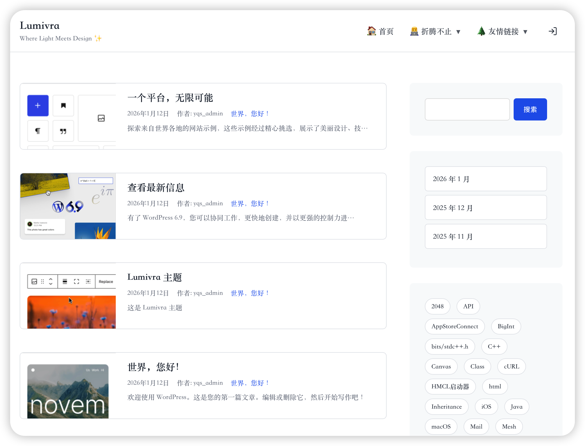

# Lumivra - Where Light Meets Design ✨

## 关于 Lumivra

**Lumivra** 是一个干净、现代、富有设计感的 WordPress 主题。专为追求极简美学和优雅排版的内容创作者、博客作者和企业网站打造。主题名称源自 "Lumi"（光）和 "Vibrant"（充满活力），希望为您的主页带来光明和活力。

🏠 主题主页：https://lumivra.yanqs.me/

📄 使用文档：https://lumivra.yanqs.me/doc/

### 主题特色

✨ **现代设计**
- 清爽简洁的界面设计
- 优雅的排版系统
- 响应式布局，完美适配所有设备

🎨 **高度可定制**
- 完整的主题自定义器支持
- 自定义颜色方案
- 灵活的布局选项
- 字体和排版控制

⚡ **性能优化**
- 轻量级代码
- 优化的资源加载
- 快速加载速度

🔧 **功能丰富**
- 自定义导航菜单
- 小工具区域支持
- 文章格式支持
- 社交媒体链接集成
- 搜索引擎优化友好
- 短代码支持

## 安装方法

### 方法一：通过 WordPress 后台安装

1. 登录到您的 WordPress 管理后台
2. 导航至 **外观 > 主题 > 添加新主题**
3. 点击 **上传主题**
4. 选择 `lumivra.zip` 文件
5. 点击 **立即安装**
6. 安装完成后点击 **启用**

### 方法二：通过 FTP 安装

1. 解压 `lumivra.zip` 文件
2. 通过 FTP 将 `lumivra` 文件夹上传到 `/wp-content/themes/` 目录
3. 登录 WordPress 后台
4. 导航至 **外观 > 主题**
5. 找到并启用 Lumivra 主题

## 系统要求

- WordPress 5.8 或更高版本
- PHP 7.4 或更高版本
- MySQL 5.6 或更高版本
- 支持现代浏览器（Chrome、Firefox、Safari、Edge）

## 核心功能说明

### 🎨 双重配置系统

主题提供两种配置方式，满足不同用户的偏好：

#### 方式一：后台设置页面（推荐）
- 位置：**外观 > Lumivra 设置**
- 优点：传统表单界面，简单直观，集中管理
- 详细说明：[使用指南](https://lumivra.yanqs.me/doc/)

#### 方式二：主题自定义器
- 位置：**外观 > 自定义**
- 优点：实时预览，可视化调整

**注意**：优先级为后台设置页面 > 主题自定义器

### 📝 文章卡片布局

- 水平布局设计
- 左侧缩略图（200×140px）
- 固定卡片高度（140px）
- 单行摘要显示
- 悬停动画效果

### 👤 用户认证 UI

- 未登录：显示登录图标按钮
- 已登录：显示用户头像和下拉菜单
  - 仪表盘链接
  - 个人资料链接
  - 登出选项

### 🔗 多级导航菜单

- 支持下拉子菜单
- 箭头指示器
- 平滑展开动画
- 移动端友好

###  🔧 多种短代码支持

- 支持 Github 仓库短代码
- 支持 LateX 公式短代码

### 🎭 自定义登录页面

- 左右分屏设计（40% 蓝色/60% 白色）
- 品牌标识显示
- 现代化表单设计
- 完全响应式

### 🖼️ 智能图片处理

- 自动图片尺寸生成
- 缩略图硬裁剪确保一致性
- 懒加载支持
- 404 错误防护

## 主题支持

### 标准 WordPress 功能

- 自定义 Logo
- 自定义背景
- 自定义颜色
- 文章缩略图
- 自定义菜单
- HTML5 标记
- 响应式嵌入
- 选择性刷新小工具

### 编辑器支持

- 编辑器样式
- 宽对齐和全宽对齐
- 自定义颜色面板

## 浏览器支持

✅ Chrome (最新版)
✅ Firefox (最新版)
✅ Safari (最新版)
✅ Edge (最新版)
✅ Opera (最新版)

移动浏览器完全支持。

## 开发信息

### 技术栈

- **前端**：HTML5, CSS3 (CSS 变量), JavaScript (ES6+)
- **框架**：jQuery 3.x
- **后端**：PHP 7.4+, WordPress 5.8+
- **字体**：Google Fonts, jsDelivr CDN
- **图标**：SVG icons

### 主要特性

- CSS Grid & Flexbox 布局
- CSS 变量动态主题
- WordPress Customizer API
- WordPress Settings API
- 响应式图片处理
- 自定义 Walker 类（导航菜单）
- 自定义登录页面钩子

### 代码规范

- WordPress 编码标准
- PHP PSR-12 风格
- ESLint (JavaScript)
- 语义化 HTML5

## 性能优化

- ⚡ 轻量级代码（< 50KB 压缩后）
- 🚀 CDN 字体加载
- 📦 资源按需加载
- 🖼️ 图片懒加载
- 💾 浏览器缓存优化
- 🔍 SEO 友好的标记

## 安全性

- ✅ 数据转义和验证
- ✅ Nonce 验证
- ✅ SQL 注入防护
- ✅ XSS 防护
- ✅ CSRF 防护

## 可访问性

- ♿ ARIA 标签支持
- ⌨️ 键盘导航友好
- 🎨 颜色对比度符合 WCAG 2.1 AA 标准
- 📱 屏幕阅读器优化

## 许可证

Lumivra 主题采用 [GPL v2 或更高版本](http://www.gnu.org/licenses/gpl-2.0.html) 许可证。

## 贡献

欢迎提交问题报告、功能请求或拉取请求。

## 致谢

感谢 WordPress 社区的所有贡献者。

## 相关链接

- 主题主页：https://lumivra.yanqs.me/
- 使用文档：https://lumivra.yanqs.me/doc/
- 作者主页：https://yanqs.me

---

**Lumivra - Where Light Meets Design** ✨
